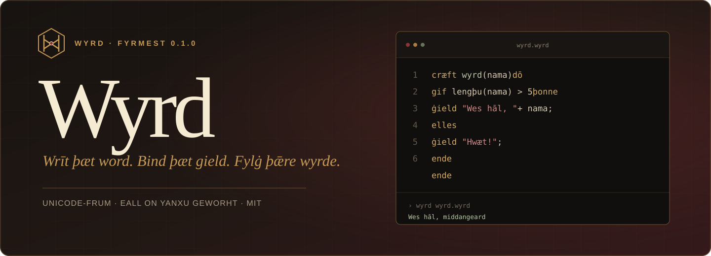
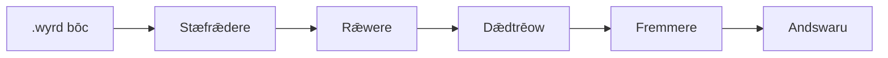

<p align="center">
  
</p>

<p align="center">
  <a href="https://github.com/bunwright/wyrd-lang/actions/workflows/ci.yml"></a>
  <a href="https://github.com/bunwright/wyrd-lang/actions/workflows/pages.yml"></a>
  
  <a href="LICENSE"></a>
</p>

<p align="center">
  <strong>Ān nīwe, Unicode-frum talusprǣc mid ealdum Ængliscum wordum.</strong><br>
  Eall se fremmere, rǣwere, stæfrǣdere, and bēodrǣw is on Yanxu awriten.
</p>

<p align="center">
  <a href="https://bunwright.github.io/wyrd-lang/"><strong>Þā handbōc rǣd →</strong></a>
  &nbsp;&nbsp;·&nbsp;&nbsp;
  <a href="examples/">Bysena geseon</a>
</p>

---

## Hwæt is Wyrd?

Wyrd is ān open, dǣdrǣd talusprǣc. Hire wordhord cymþ of Ealdenglisce; hire inneweard is nīwe geworht. Hēo hæfþ āwendlīc and fæst gebind, rǣwas, gecorennys, ymbhwyrftas, eftclipung, and gecnutene lēafscopas.

```wyrd
cræft fib(n) dō
    gif n <= 1 þonne
        ġield n;
    elles
        ġield fib(n - 1) + fib(n - 2);
    ende
ende

for n on rīm(0, 10) dō
    cweþ fib(n);
ende
```

Þis is nā foresteall and nā cȳþwordes hīw. Wyrd hæfþ hire āgen stæfrǣdere, rǣwere, dǣdtrēow, fremmere, gedwolancwide, and CLI—[eall nīwe geworht on Yanxu](https://bunwright.github.io/wyrd-lang/ymbwyrft/yanxu/).

## Hrædlic ongin

Þū þurft [Yanxu 1.1.20 oþþe nīwran](https://github.com/yanxulang/yanxu).

```sh
git clone https://github.com/bunwright/wyrd-lang.git
cd wyrd-lang
yanxu 行 src/主.yx -- examples/wes-hal.wyrd
```

Sēo andswaru:

```text
Wes hāl, middangeard!
Þæt word is lang.
```

Wyrd bōc fandian būtan fremminge:

```sh
yanxu 行 src/主.yx -- fand examples/fibonacci.wyrd
```

Bytubōc timbrian:

```sh
yanxu 编 . -o build/wyrd.yxb --release
```

## Þæt mæġen

| | Wyrd 0.1.0 |
| --- | --- |
| **Stafas** | Unicode naman; `þ`, `ð`, `æ`, `ġ`, and macronstafas |
| **Gield** | `tæl`, `word`, `sōþgield`, `nāwiht`, `rǣw`, `cræft` |
| **Gebind** | `lǣt` for āwendlīc; `fæst` for unāwendlīc |
| **Flōw** | `gif` / `þonne` / `elles`, `þāhwīle`, `for` / `on` |
| **Cræftas** | inġehāt, `ġield`, eftclipung, beclysed lēafscop |
| **Inbyrd** | `rīm`, `lengþu`, `cynn`, `tōworde` |
| **Gedwolan** | fæste cȳþstafas mid rǣw and stefn |
| **Timbrung** | 100% Yanxu; interpreter and Yanxu bytubōc |

## Se bygn



| Bōc | Dǣd |
| --- | --- |
| [`src/词法.yx`](src/词法.yx) | Unicode stæfrǣdere and tācnu |
| [`src/语法.yx`](src/语法.yx) | fore-rǣd rǣwere and dǣdtrēow |
| [`src/求值.yx`](src/求值.yx) | fremmere, lēafscopas, and cræftas |
| [`src/wyrd.yx`](src/wyrd.yx) | open sprǣcingang |
| [`src/主.yx`](src/主.yx) | bēodrǣw |

## Fandunga

```sh
yanxu 试 tests
```

Þæt fandhord cȳþ stæfrǣd, rǣd, fremming, ymbhwyrft, cræft, and wēnlicne fæst-gedwolan.

## Bōcland

Sēo fulla handbōc is mid [Astro Starlight](https://starlight.astro.build/) getimbrod and þurh GitHub Pages gecȳþed:

**[bunwright.github.io/wyrd-lang](https://bunwright.github.io/wyrd-lang/)**

## Gehelp

Rǣd [`CONTRIBUTING.md`](CONTRIBUTING.md) ǣr þū bōc sende. Heald ælcne fremmendlīcne dǣl on Yanxu.

## Līe

Wyrd is under [MIT līe](LICENSE). © 2026 bunwright.
